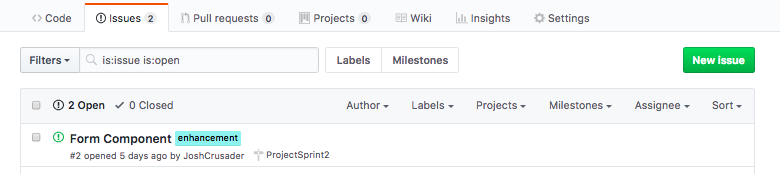
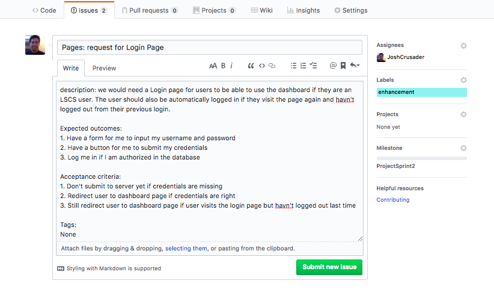
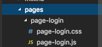
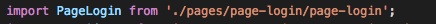
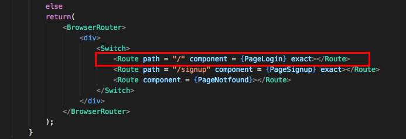

# Contributing
before learning how to contribute to this project, first study the [structure](STRUCTURE.md) of this project

## Table of contents
1. [New Issue](#new-issue)
2. [New Pages](#new-pages)
3. [New Components](#new-components)
4. [New Smart Components](#new-smart-components)
5. [New Mixins](#new-mixins)
6. [New Actions](#new-actions)
7. [New Reducers](#new-reducers)
8. [New Branch](#new-branch)
9. [Pull Request](#pull-request)
10. [Commit Conventions](#commit-conventions)


## New Issue
Making a new Issue means you are requesting for a change in the reposity whether it may be a bug report or asking for additional/enhancing components.
The issues would act as a guideline on what branches needs to improve on

When Making a new issue it should consider the following(please take note component_type may be component/pages/smart components/any directory from src folder):

#### Title
##### (<component_type>: short description of issue)
The title would container a brief description of the issue

#### description
the description of the issue

#### Expectated outcomes
expected outcome after resolving an issue, this may be thought of as modules

#### Acceptance criteria
Acceptance criteria, before a pull request is merged to the develop branch it must have solved all the acceptance criteria of the issue

#### Tags (optional)
The issues this issue may be related for example (#1, #2), but may be optional if you decide you don't want to

#### Labels
the appropriate labels of the issue (seen at the right side)

#### Assignees (optional)
assigned developer to the issue

#### Milestone (optional)
deadline of the issue to be resolved

(Take note (optional): You may comment on thoes issues the files that are changed in relation to the issue for easier tracking even before pushing)



## New Pages
When contributing to pages, you are to make a page-component that will render other components that may be needed in the **pages** directory





you will then need to import the page component in **routes.js** to be able render them when the user goes to your specified route





Afterwards, you should be add a new route still in the routes.js file with the proper parameters connecting to your page component




## New Components
When contributing to pages, you will need to make this structure in the src->components directory
```bash
src
└── components
    └── yourcomponent
        ├── yourcomponent.css
        └── yourcomponent.js
```
**yourcomponent** would be the directory of your component

**yourcomponent.css(optional)** would contain the styling of your component. 

**yourcomponent.js** woul contain the component class itself and export it for use in other components

To start making your component, you would need to import these necessary modules from our node modules
```javascript
import React, { Component } from 'react'; // import react to keep the file within react's scope for jsx and we would deconstruct component from react so our custom class component could extend from it
import './yourcomponent.css'; // import the css for the component to use
```
these are the basic libraries needed to a component, next to start of making a component
```javascript
class YourComponent extends Component { //our class extends component, notice the camel case
  
  render() { //every class requires a render function that would return the template the component would render
    return ( //returns template, when returning a template, you could only return one component so make sure all your components are under only one component
      <div>
        Hello World
      </div>
    );
  }
}

export default YourComponent; //exports our custom component as YourComponent
```
Now that our *yourcomponent.js* file can export our custom component, it means we could import it to use in other components
### To use your new component
Lets say we have another component in our project
```bash
src
└── components
    └── yourcomponent
        ├── yourcomponent.css
        └── yourcomponent.js
    └── anothercomponent
        ├── anothercomponent.css
        └── anothercomponent.js
```
now we want to use yourcomponent and render it in anothercomponent, lets go to anothercomponent.js and following the previous section it should look like this and yourcomponent would be used  as follows:
```javascript
import React, { Component } from 'react';
import './anothercomponent.css';
import YourComponent from '../components/yourcomponent/yourcomponent'; //this is the path of yourcomponent and you don't need to specify the .js extension in the end, nodejs would find it for you
class AnotherComponent extends Component {
  /*
    We would now use YourComponent in this component,
    and lets say we would want to render 5 yourcomponents so we just use it 5 times 
  */
  render() {
    return (
      <div>
        <YourComponent></YourComponent>
        <YourComponent></YourComponent>
        <YourComponent></YourComponent>
        <YourComponent></YourComponent>
        <YourComponent></YourComponent>
      </div>
    );
  }
}

export default AnotherComponent;
```

### States
To be able to use variables inside our html template, we need to 
**States** are basically our immutable properties,

(more docs to come soon)
and thats how we use components with other components, just use it with your pages/smart components

## New Smart Components
no documentation yet

## New Mixins
no documentation yet

## New Actions
no documentation yet


## New Reducers
no documentation yet

## New Branch
This project would follow git flow meaning we would have
master - the branch that would be shown every iteration
develop - the branch where features get merged for everyone to use
feature/featurename - the branch where features would be developed

you may develop other branches for testing but dont push inappropriate branch names, just on feature branches

To create a new branch in local your repository:
```bash
git checkout -b feature/featurename
```

to push your branch to the remote repository branch:
```bash
git push origin feature/featurename
```


## Pull Request
convention is:
"issue_number: description of the pull request"

## Commit Conventions
convention:
"issue_number: description of commit"

[go back](../README.md)